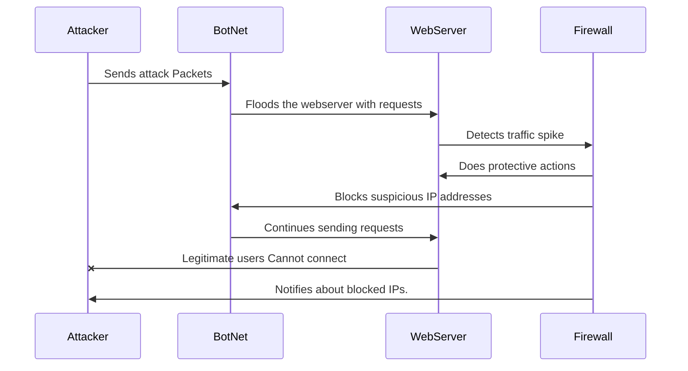

# DDoS Attack Sequence Diagram

  

##Documentation
    Attacker to BotNet: The nework attacker controls a botnet and sends commands to begin the attack.
    
    BotNet to Webserver: Botnet recieves the request and starts sending an overwhelming amount of traffic to the webserver.
    
    Webserver to Firewall: The webserver fowards the incoming malicious traffic to its firewall but it may struggle
    to differenitiate between legitiame an malicious requests.

    Firewall to Botnet: Firewall attempts to mitigate the attack but since the botnet consists of many IP addresses 
    and complicated methos to bypass the servers fiewall.
    
    BotNet to WebServer: BotNet learns the webservers bulnerabilites and adapts its attacking methods to exploit 
    the weaknesses. It continues to send more ovewhelming requests to the server.
    
    Webserver to Attacker: The websever, overwhelmed with requests, experiencees loss in perfomance or crashes denying 
    legitimate users access.
